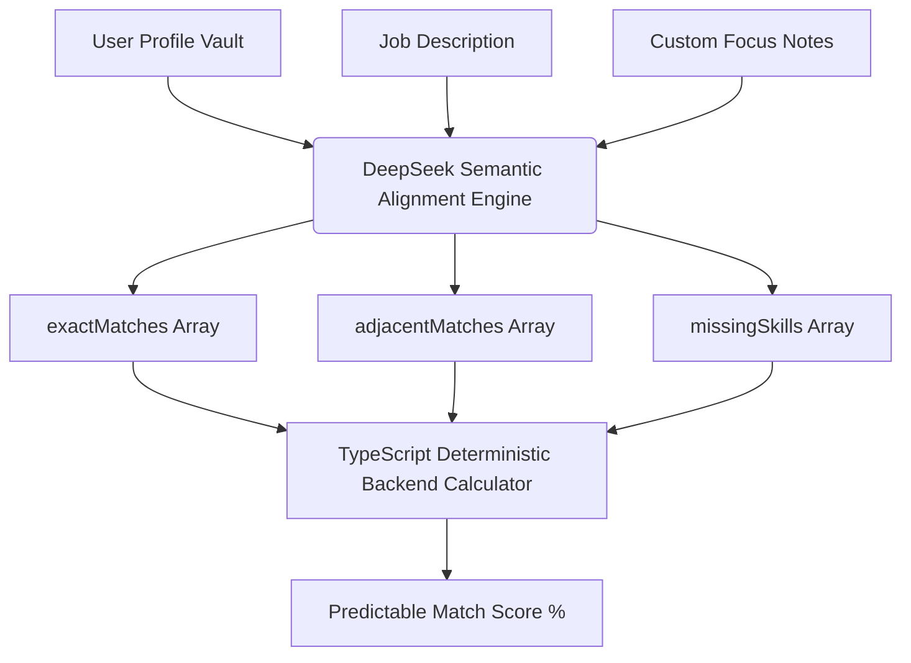

# Algorithm and Architectural Explanations (Phase 3 Documentation)

This document provides a technical explanation of the underlying layout structures and data algorithms utilized in the Job Flow AI tailoring engine.

---

## 1. ATS Compatibility Strategy

Applicant Tracking Systems (ATS) are automated database engines used by HR departments to scan, filter, and parse job applications. Many modern systems (e.g., Workday, Taleo, Greenhouse) ingest resumes and score candidates based on extracted text metrics. If a resume cannot be read correctly by the ATS parser, the candidate is automatically filtered out.

Our document rendering templates (including the International Resume format and the German DIN 5008 Cover Letter template) are engineered to be **100% ATS-friendly** through the following technical design patterns:

### A. Programmatic Vector Text Layering (No Canvas or Browser print)
- **Problem:** Programmatic conversions that output PDFs as static image layers or flat canvas pixels are completely blank to an ATS parser. Similarly, browser-dependent iframe-based printing (`window.print()`) introduces visual variance and system print layout interference (like automatic headers, footers, and margins).
- **Solution:** Our PDF export pipeline utilizes programmatically controlled PDF generation (such as `@react-pdf/renderer` or similar server-side document rendering engines) to directly compile the layout. This ensures exact, pixel-perfect DIN 5008 spacing and standard UTF-8 text layering without browser UI print dialog interference.
- **Text Selectability:** All text (including bullet points, header text, and dates) is generated as native vector text streams, making it 100% copy-selectable, searchable, and machine-readable.

### B. Standard Character Encoding (Unicode Compliance)
- **Problem:** Many modern visual builders use custom web fonts with corrupt Unicode character maps. When printed to PDF, the characters look normal visually but decode into garbled junk characters in text streams.
- **Solution:** We enforce standardized, widely indexed fonts (such as "Inter", "Arial", "Calibri", and "Georgia") in both visual styling and exported files. This guarantees that character bytes map to standard UTF-8 indices, preventing parsed text from corrupting during ingestion.

### C. DOM Reading Order (Column-First Hierarchy)
- **Problem:** Multi-column layouts (e.g., sidebar column next to main experience column) often scramble text when processed by ATS engines. If columns are grouped horizontally line-by-line (such as layout systems that place Sidebar Item 1 next to Experience Item 1 in the markup), standard ATS scanners—which read text strictly horizontally left-to-right—will interleave unrelated text fragments across columns, completely scrambling chronological timelines and profile descriptions.
- **Solution:** To maintain structural integrity, all two-column templates are enforced to render as complete vertical subtrees in the DOM. The DOM structure must compile Column A entirely (top-to-bottom) before starting Column B entirely. By keeping columns completely separate in the DOM tree hierarchy, ATS parsers naturally extract all information from the first column in sequence, followed by the second column, preserving logical sections and timelines.

### D. Conforming DIN 5008 Structural Predictability (German Markets)
- **DIN 5008 Alignment:** In the DACH region, resumes and cover letters are ingested by specialized parsers trained on the German DIN 5008 layout guidelines. 
- **Solution:** The Cover Letter template maintains exact dimensions for the sender block, recipient field, right-aligned date line, and bold subject header. Because the visual coordinates conform exactly to the DIN 5008 spacing standards, German ATS parsers can cleanly extract metadata fields (e.g., candidate name, target company, sender city) without alignment offset errors.

---

## 2. The Match Score Algorithm

The **Match Score** is a dynamic percentage value (0 to 100) indicating how well a candidate's profile meets the target job requirements. Rather than using simple string matches, our system employs an advanced semantic calculation:

### A. Limitations of Legacy Scoring Methods
1. **Strict Keyword Intersection:** If a job description asks for "Go" and the profile lists "Golang", keyword intersection fails. If it asks for "AWS" and the candidate has "Amazon Web Services", it scores 0.
2. **TF-IDF (Term Frequency-Inverse Document Frequency):** While good for document classification, TF-IDF only measures word frequency. A resume filled with keyword repetitions would score artificially high, while a qualified candidate with a concise profile would score low.

### B. Deterministic Hybrid Scoring Implementation
To eliminate scoring variance, hallucinations, and inconsistencies associated with letting the LLM estimate percentages directly, the LLM is restricted from calculating the final match score. Instead, the scoring process is partitioned between semantic classification (done by the LLM) and deterministic calculation (done by backend TypeScript logic):

1. **Semantic Categorization (LLM Role):** The DeepSeek LLM receives the profile, job description, and custom focus notes. Its sole output is a structured JSON payload categorizing skills and requirements into three distinct arrays:
   - `exactMatches`: Core required skills, technologies, or certifications that the candidate directly possesses (e.g., "TypeScript" in requirements matches "TypeScript" in profile).
   - `adjacentMatches`: Skills or qualifications that are not keyword-identical but are semantically equivalent or transferable (e.g., "PostgreSQL" matches "MySQL", or candidate's leadership accomplishments satisfy organizational requirements).
   - `missingSkills`: Core competencies or experience requirements mentioned in the job description that are completely absent from the candidate's profile.

### C. Deterministic Match Score Calculation
Once the structured semantic categorization is returned by the LLM, our backend TypeScript engine calculates the final percentage score using a deterministic formula.

$$\text{Match Score} = \text{round}\left( \frac{w_e \cdot |E| + w_a \cdot |A|}{w_e \cdot |E| + w_a \cdot |A| + w_m \cdot |M|} \times 100 \right)$$

Where:
- $E$ = Set of Exact Matches (`exactMatches`)
- $A$ = Set of Adjacent Matches (`adjacentMatches`)
- $M$ = Set of Missing Skills (`missingSkills`)
- $w_e$ = Weight of Exact Matches (default = `1.0`)
- $w_a$ = Weight of Adjacent Matches (default = `0.5`)
- $w_m$ = Penalty Weight of Missing Skills (default = `1.0`)

This formula ensures that:
- Identical profile/job matches always yield the exact same integer score.
- The score is completely audit-ready and free from stochastic LLM behavior.
- Missing skills consistently apply a predictable penalty, while transferable adjacent skills consistently contribute partial weight.
