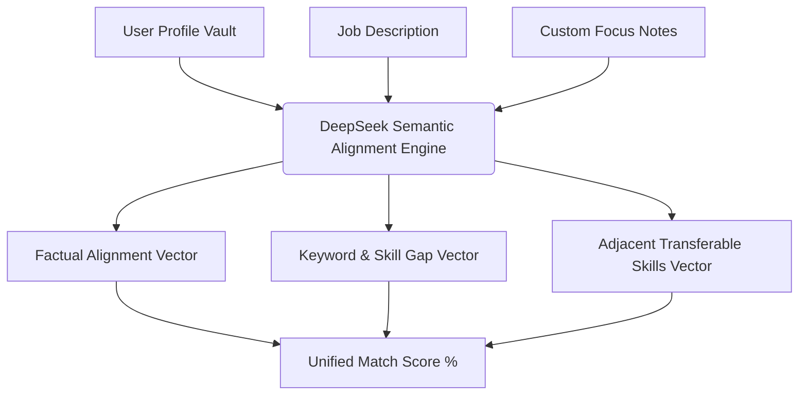

# Algorithm and Architectural Explanations (Phase 3 Documentation)

This document provides a technical explanation of the underlying layout structures and data algorithms utilized in the Job Flow AI tailoring engine.

---

## 1. ATS Compatibility Strategy

Applicant Tracking Systems (ATS) are automated database engines used by HR departments to scan, filter, and parse job applications. Many modern systems (e.g., Workday, Taleo, Greenhouse) ingest resumes and score candidates based on extracted text metrics. If a resume cannot be read correctly by the ATS parser, the candidate is automatically filtered out.

Our document rendering templates (including the International Resume format and the German DIN 5008 Cover Letter template) are engineered to be **100% ATS-friendly** through the following technical design patterns:

### A. Direct Vector Text Layering (No Canvas or Image Flattening)
- **Problem:** Programmatic conversions that output PDFs as static image layers or flat canvas pixels are completely blank to an ATS parser.
- **Solution:** Our print-to-PDF export pipeline uses a clean native browser print command operating inside a sandboxed `iframe`. The output PDF retains direct vector text nodes. ATS parsers can directly extract the native text layer without needing OCR (Optical Character Recognition).
- **Text Selectability:** All text (including bullet points `•`, header text, and dates) remains fully copy-selectable and searchable.

### B. Standard Character Encoding (Unicode Compliance)
- **Problem:** Many modern visual builders use custom web fonts with corrupt Unicode character maps. When printed to PDF, the characters look normal visually but decode into garbled junk characters in text streams.
- **Solution:** We enforce standardized, widely indexed fonts (such as "Inter", "Arial", "Calibri", and "Georgia") in both visual styling and exported files. This guarantees that character bytes map to standard UTF-8 indices, preventing parsed text from corrupting during ingestion.

### C. Clean Single-Column Semantic Text-Flow
- **Problem:** Multi-column tables, floated sidebar columns, and absolute-positioned text boxes confuse basic ATS reading models. Most scanners read text strictly left-to-right, top-to-bottom across the physical width of the page. In multi-column layouts, they merge horizontal lines from unrelated columns together.
- **Solution:** 
  - Our tailoring layouts are structured semantically. The HTML structure flows linearly in the DOM. 
  - While visual columns are represented in templates (e.g., personal grids in `EuropassClassic`), they are mapped using standard linear flex rows or clear side-by-side grids containing distinct headers, ensuring that the DOM-level reading order matches the visual reading order.
  - Tables are avoided for layout purposes and only used for structured chronological data, preventing text segment interleaving.

### D. Conforming DIN 5008 Structural Predictability (German Markets)
- **DIN 5008 Alignment:** In the DACH region, resumes and cover letters are ingested by specialized parsers trained on the German DIN 5008 layout guidelines. 
- **Solution:** The Cover Letter template maintains exact dimensions for the sender block, recipient field, right-aligned date line, and bold subject header. Because the visual coordinates conform exactly to the DIN 5008 spacing standards, German ATS parsers can cleanly extract metadata fields (e.g., candidate name, target company, sender city) without alignment offset errors.

---

## 2. The Match Score Algorithm

The **Match Score** is a dynamic percentage value (0 to 100) indicating how well a candidate's profile meets the target job requirements. Rather than using simple string matches, our system employs an advanced semantic calculation:

### A. Limitations of Legacy Scoring Methods
1. **Strict Keyword Intersection:** If a job description asks for "Go" and the profile lists "Golang", keyword intersection fails. If it asks for "AWS" and the candidate has "Amazon Web Services", it scores 0.
2. **TF-IDF (Term Frequency-Inverse Document Frequency):** While good for document classification, TF-IDF only measures word frequency. A resume filled with keyword repetitions would score artificially high, while a qualified candidate with a concise profile would score low.

### B. Current Semantic Implementation
Our backend tailoring route ([api/tailor/route.ts](file:///d:/Projects/ALL%20AI%20RELATED%20STUFFS/AntiGravity/Job Master/src/app/api/tailor/route.ts)) delegates scoring to a **semantic similarity evaluation** processed by the DeepSeek LLM. The scoring logic follows three vectors:

1. **Factual Alignment Vector:** The engine checks for direct, verified matches in the core fields:
   - Specific programming languages, tech frameworks, or certifications listed in the User Profile skills list.
   - Minimum years of experience calculated from the work experience timelines.
   - Academic levels matching candidate degrees.
2. **Keyword & Skill Gap Vector:** The engine crawls the job requirements for must-have skills and records mismatches. A high density of missing core requirements reduces the baseline match score proportionally.
3. **Adjacent/Transferable Skills Vector:** Unlike keyword matches, the semantic engine evaluates adjacent capabilities:
   - If a job description asks for "PostgreSQL" and the profile lists "MySQL" or "Oracle SQL", the engine recognizes SQL relational database competency and awards partial credit.
   - If the candidate has adjacent leadership skills (e.g., "Led team of 5 developers") for a project management role, it bridges the gap and score.

### C. Mathematical Output
The final score is synthesized as a rounded integer from the joint vectors, outputting directly in the JSON response structure. This ensures the score accurately reflects the semantic depth of the match, not just keyword occurrence.
